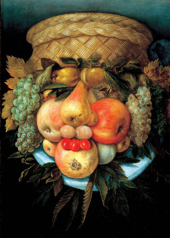

---
jupytext:
  text_representation:
    extension: .md
    format_name: myst
    format_version: 0.13
kernelspec:
  display_name: Python 3 (ipykernel)
  language: python
  name: python3
---

+++ {"deletable": false, "editable": false, "nbgrader": {"cell_type": "markdown", "checksum": "d53824e065ad5ba1ac1ce5cf3895adcc", "grade": false, "grade_id": "cell-4911a792a82448d7", "locked": true, "schema_version": 3, "solution": false}, "slideshow": {"slide_type": ""}, "tags": []}

# Traitement d'images

+++ {"deletable": false, "editable": false, "nbgrader": {"cell_type": "markdown", "checksum": "dc915558666bf51cc706c5ec7f5a1049", "grade": false, "grade_id": "cell-4911a792a82448d8", "locked": true, "schema_version": 3, "solution": false}}



[Giuseppe Arcimboldo](https://en.wikipedia.org/wiki/Giuseppe_Arcimboldo)
était un peintre du 16ème siècle qui a créé des portraits imaginaires
à partir de fruits, légumes, fleurs, poissons et livres.

+++ {"deletable": false, "editable": false, "nbgrader": {"cell_type": "markdown", "checksum": "db3b1229531d4106908337f989322015", "grade": false, "grade_id": "cell-4911a792a82448d5", "locked": true, "schema_version": 3, "solution": false}}

## Objectif

+++ {"deletable": false, "editable": false, "nbgrader": {"cell_type": "markdown", "checksum": "96cbc8972d0ccbfe0bbcc065a43ff70e", "grade": false, "grade_id": "cell-4911a792a82448dz", "locked": true, "schema_version": 3, "solution": false}}

Dans cette feuille, vous allez créer une séquence d'images
transformant pas à pas le smiley ci-dessous en une peinture à la
Arcimboldo, puis les assembler pour réaliser une petite animation!


+++ {"deletable": false, "editable": false, "nbgrader": {"cell_type": "markdown", "checksum": "268c9d27c3bb5b7d6c40410f21f6fc6b", "grade": false, "grade_id": "cell-0ab4b2cc4ca88a9d", "locked": true, "schema_version": 3, "solution": false, "task": false}, "slideshow": {"slide_type": ""}}

Voici les étapes du projet:

0. Extraire la partie droite de l'image pour avoir une image carrée
1. Extraire le smiley de son fond
2. Recadrer l'image sans changement de résolution, de sorte à obtenir
   une image de taille 256x256 centrée sur le smiley,
1. Réduire la résolution à 128x128, avec une technique anti-crénelage,
   par lissage puis sous-échantillonage.
2. Extraire les contours du smiley pour en faire une image noir et
   blanc.
3. Mettre en toile de fond un papier-peint représentant des fruits
4. Choisir trois images de fruits et les extraires de leur fond.
5. Remplacer les yeux et la bouche du smiley par ces fruits

Lors de ces étapes, guidées pas-à-pas, vous apprendrez à:

* Appliquer un filtre pixel-à-pixel pour extraire le premier plan
  d'une image
* Appliquer un filtre de convolution, construire une pyramide
  Gaussienne et choisir le bon niveau de lissage avant de
  sous-échantillonner.
* Appliquer un filtre de convolution par différence pour extraire un
  contour.

```{code-cell} ipython3
---
deletable: false
editable: false
nbgrader:
  cell_type: code
  checksum: d7e0788fa693c6f3cfd15b2965218be3
  grade: false
  grade_id: cell-8b77acf5d2044f9d
  locked: true
  schema_version: 3
  solution: false
  task: false
---
# Automatically reload code when changes are made
%load_ext autoreload
%autoreload 2
from PIL import Image, ImageDraw, ImageFont
import matplotlib.pyplot as plt
from scipy import signal
# Configuration intégration dans Jupyter
%matplotlib inline

from intro_science_donnees import *
from utilities import *
```

+++ {"deletable": false, "editable": false, "nbgrader": {"cell_type": "markdown", "checksum": "6fb6239a02348e4b02e5ce212099fde0", "grade": false, "grade_id": "cell-4911a792a82448d6", "locked": true, "schema_version": 3, "solution": false}}

## Lecture de l'image et extraction d'une sous image carrée

+++ {"deletable": false, "editable": false, "nbgrader": {"cell_type": "markdown", "checksum": "a644d30909928f977a01766c0a18a1d1", "grade": false, "grade_id": "cell-f9c262f57c64875f", "locked": true, "schema_version": 3, "solution": false, "task": false}}

:::{admonition} Exercice

Chargez l'image `smiley.jpg` situé dans le dossier `media` et affectez-la à la variable `img`.


**Indication:** consultez la feuille [image](../Semaine4/2_images.md) de la Semaine4 si besoin.

:::

```{code-cell} ipython3
---
deletable: false
nbgrader:
  cell_type: code
  checksum: 008a67a777b831de1e3c65e636811327
  grade: false
  grade_id: cell-92bac537558258c7
  locked: false
  schema_version: 3
  solution: true
  task: false
---
img = Image.open("media/smiley.jpg")
img
```

```{code-cell} ipython3
---
deletable: false
editable: false
nbgrader:
  cell_type: code
  checksum: c87c89764765110747a34fa70e4b8dc4
  grade: true
  grade_id: cell-c675bf3b26f50459
  locked: true
  points: 1
  schema_version: 3
  solution: false
  task: false
---
assert img.width == 640
assert img.height == 427
```

+++ {"deletable": false, "editable": false, "nbgrader": {"cell_type": "markdown", "checksum": "4315b3d78189fffd33afdf7b5c01642d", "grade": false, "grade_id": "cell-ed8c5d85b92064e9", "locked": true, "schema_version": 3, "solution": false, "task": false}}

La bibliothèque `PIL` fournit une méthode [`crop`](https://pillow.readthedocs.io/en/stable/reference/Image.html) pour recadrer des images. Elle prend en paramètre une liste `(left, upper, right, lower)` donnant successivement les coordonnées des points en haut à gauche et en bas à droite de la zone rectangulaire (*box*) à extraire. Voici, par exemple, l'image recadrée pour les points de coordonnées (0,0) et (200,100):

```{code-cell} ipython3
---
deletable: false
editable: false
nbgrader:
  cell_type: code
  checksum: 99316d61711c5af8a68ee8e446bc30c8
  grade: false
  grade_id: cell-fb8b435f0255e63a
  locked: true
  schema_version: 3
  solution: false
  task: false
---
img.crop(box=(0,0,200,100) )
```

+++ {"deletable": false, "editable": false, "nbgrader": {"cell_type": "markdown", "checksum": "7d0c7c146e0ff51000267b128d4d20e4", "grade": false, "grade_id": "cell-81da809741dda4f6", "locked": true, "schema_version": 3, "solution": false, "task": false}}

:::{admonition} Exercice

 Recadrer l'image pour ne garder que sa partie droite et de sorte à ce qu'elle soit carrée. Affectez le résultat à la variable `img_carree`.

**Indication :** Faites un dessin sur papier. Quel coin garder ? Comment trouver les autres coordonnées ? Pour cela, commencez par identifier la plus petite dimension entre la largeur (width) et la hauteur (height). Vous ferez en sorte que le carré soit de cette dimension là (on charche à garder le plus grand carré possible).

:::

```{code-cell} ipython3
---
deletable: false
nbgrader:
  cell_type: code
  checksum: d9932c416ff7a5f1a6065979b6f6b2d3
  grade: false
  grade_id: cell-3fd205dc2e602eb8
  locked: false
  schema_version: 3
  solution: true
  task: false
---
x_gauche, y_haut = 213, 0
x_droite, y_bas = 640, 427

img_carree = img.crop(box=(x_gauche, y_haut, x_droite, y_bas))
img_carree
```

```{code-cell} ipython3
---
deletable: false
editable: false
nbgrader:
  cell_type: code
  checksum: 18bf2d3acd2515b191ece39d2725049c
  grade: true
  grade_id: cell-6d458608eabf2832
  locked: true
  points: 1
  schema_version: 3
  solution: false
  task: false
---
# Vérifications: on obtient une image de la bonne taille
assert isinstance(img_carree, Image.Image)
assert img_carree.size == (427, 427)
```

+++ {"deletable": false, "editable": false, "nbgrader": {"cell_type": "markdown", "checksum": "6cc1c7ee723a542f67ba8daf3a57d783", "grade": false, "grade_id": "cell-102f16e91f85d795", "locked": true, "schema_version": 3, "solution": false, "task": false}}

Ce sera la première image de votre animation!

Pour produire cette dernière, vous stockerez les images successives dans une liste `images`,
puis les assemblerez à la fin. Commençons par celle-ci:

```{code-cell} ipython3
---
deletable: false
editable: false
nbgrader:
  cell_type: code
  checksum: 46be2e4904f3961538e94ad56488a904
  grade: false
  grade_id: cell-b5f655311351c33e
  locked: true
  schema_version: 3
  solution: false
  task: false
---
# Initialise une liste d'images vide
images = []
# Rajoute une image à la fin
images.append(img_carree)
```

+++ {"deletable": false, "editable": false, "nbgrader": {"cell_type": "markdown", "checksum": "8a23ab53869240c1f887d50ef6d05171", "grade": false, "grade_id": "cell-411b36bd0cb5826d", "locked": true, "schema_version": 3, "solution": false, "task": false}}

La méthode `append` permet d'ajouter des élements à la fin d'une liste. Nous la réutiliserons pour mettre à jour `images` au fur et à mesure du TP.

```{code-cell} ipython3
---
deletable: false
editable: false
nbgrader:
  cell_type: code
  checksum: fcaa975d6d815192f97e058cc9310adf
  grade: false
  grade_id: cell-181b4e0dd4bfe5da
  locked: true
  schema_version: 3
  solution: false
  task: false
---
image_grid(images)
```

+++ {"deletable": false, "editable": false, "nbgrader": {"cell_type": "markdown", "checksum": "4fdcc3eb6ec5aea2d6eb9f819068b43a", "grade": false, "grade_id": "cell-3c64df0a682e05ba", "locked": true, "schema_version": 3, "solution": false, "task": false}}

## Le générique de l'animation

+++ {"deletable": false, "editable": false, "nbgrader": {"cell_type": "markdown", "checksum": "355dc87534f98338a103897aa1113070", "grade": false, "grade_id": "cell-3c64df0a682e05bb", "locked": true, "schema_version": 3, "solution": false, "task": false}}

Lorsque l'on produit une œuvre, ici une animation, l'attribution de l'œuvre à ses auteurs est un élément indispensable. Pour cela, vous allez maintenant écrire votre nom et prénom sur l'image. 

:::{admonition} Exercice - question 1

Affectez votre nom à la variable `name`.

:::

```{code-cell} ipython3
---
deletable: false
nbgrader:
  cell_type: code
  checksum: 6a289e60c0758f1179ae37f5b819e96c
  grade: false
  grade_id: cell-be303b49eea2cef9
  locked: false
  schema_version: 3
  solution: true
  task: false
---
name = "Malapert Rémi"
```

```{code-cell} ipython3
---
deletable: false
editable: false
nbgrader:
  cell_type: code
  checksum: 4f0bb030fb7b816af6fef371b72e19a6
  grade: true
  grade_id: cell-e5297ed9595b81ed
  locked: true
  points: 1
  schema_version: 3
  solution: false
  task: false
---
assert isinstance(name, str)
```

+++ {"deletable": false, "editable": false, "nbgrader": {"cell_type": "markdown", "checksum": "366d0ab74ce5b26f348f3448168faebc", "grade": false, "grade_id": "cell-d3dd8f14b08a316d", "locked": true, "schema_version": 3, "solution": false, "task": false}}

:::{admonition} Exercice - question 2

 Étudiez en détail les quatre commandes suivantes qui respectivement:
    - font une copie de l'image
    - construisent un canevas pour dessiner sur cette image
    - choisissent une fonte (si vous voulez changer essayez 'DejaVuSans.ttf' qui devrait etre disponible ou lisez les indications)
    - dessinent un texte
  
***Indication***: la liste des fonts *disponibles sur MyDocker-VD* peut être obtenue en tapant dans une cellule de code `! ls /opt/conda/fonts` (le point d'exclammation indique que ce n'est pas du python mais du bash).

:::

```{code-cell} ipython3
---
deletable: false
editable: true
nbgrader:
  cell_type: code
  checksum: 4838331d13f1db33fff915d7378df82b
  grade: false
  grade_id: cell-19ee6a31a2222995
  locked: true
  schema_version: 3
  solution: false
  task: false
slideshow:
  slide_type: ''
tags: []
---
img_title = img_carree.copy()
canvas = ImageDraw.Draw(img_title)
try: 
    font_name = os.path.join(os.environ["CONDA_PREFIX"], "fonts", "arial.ttf") #en 336, en local
except:
    font_name = os.path.join(os.environ["CONDA_DIR"], "fonts", "arial.ttf") # sur le hub
font = ImageFont.truetype(font_name, size=40)
canvas.text(xy=(85,10), text=name, font=font)
```

+++ {"deletable": false, "editable": false, "nbgrader": {"cell_type": "markdown", "checksum": "b95bb0b87ecdfdbcfc86480d84f5adb2", "grade": false, "grade_id": "cell-fb141f73fee79810", "locked": true, "schema_version": 3, "solution": false, "task": false}, "slideshow": {"slide_type": ""}, "tags": []}

:::{admonition} Exercice -question 3

Affichez l'image avec le titre qui vient d'etre créée

:::

```{code-cell} ipython3
---
deletable: false
editable: true
nbgrader:
  cell_type: code
  checksum: 8ce3852cd9abb1a5202e9960ed2be157
  grade: true
  grade_id: cell-6ef52624ea6e4ef0
  locked: false
  points: 0
  schema_version: 3
  solution: true
  task: false
slideshow:
  slide_type: ''
tags: []
---
img_title
```

+++ {"deletable": false, "editable": false, "nbgrader": {"cell_type": "markdown", "checksum": "512f36a6d448994c9a7c52e9f2b6b173", "grade": false, "grade_id": "cell-3783842fee0fa240", "locked": true, "schema_version": 3, "solution": false, "task": false}, "slideshow": {"slide_type": ""}, "tags": []}

:::{admonition} Exercice - question 4

 Quel paramètre permet de définir où le texte sera écrit ?

 :::

+++ {"deletable": false, "nbgrader": {"cell_type": "markdown", "checksum": "51c4b43470ea20918a5d9f93407ef5d7", "grade": true, "grade_id": "cell-2659ce1a52cb7955", "locked": false, "points": 0, "schema_version": 3, "solution": true, "task": false}}

`xy=(100,10)` permet de dire où le texte sera écrit.

+++ {"deletable": false, "editable": false, "nbgrader": {"cell_type": "markdown", "checksum": "3bf494530430db6751d83441793ed1d7", "grade": false, "grade_id": "cell-4957e043a46e3b57", "locked": true, "schema_version": 3, "solution": false, "task": false}}

:::{admonition} Exercice - question 5

 Ajoutez l'image produite à la liste `images`

 :::

```{code-cell} ipython3
---
deletable: false
nbgrader:
  cell_type: code
  checksum: 2598f66a9a5a850dd8bad30671515ca5
  grade: false
  grade_id: cell-fe1a254856187eff
  locked: false
  schema_version: 3
  solution: true
  task: false
---
images.append(img_title)
image_grid(images)
```

```{code-cell} ipython3
---
deletable: false
editable: false
nbgrader:
  cell_type: code
  checksum: 28f7a8c9617d286c23a79d8865fae807
  grade: true
  grade_id: cell-fe1b25c906541db9
  locked: true
  points: 1
  schema_version: 3
  solution: false
  task: false
---
assert len(images) >= 2
assert images[-1] is img_title
```

+++ {"deletable": false, "editable": false, "nbgrader": {"cell_type": "markdown", "checksum": "8b908c5d9f11630b7ce4f0735eaf6b1e", "grade": false, "grade_id": "cell-3e3d73027e521171", "locked": true, "schema_version": 3, "solution": false, "task": false}}

:::{admonition} Exercice ♣ - question 6

Modifiez ce qui précède pour personnaliser votre générique. Voici quelques idées:
    - explorez les options de `canvas.text` pour dessiner le texte selon vos préférences (couleur, fonte, position, ...);
    - ajoutez non pas une seule image à `images`, mais une séquence d'images de sorte à réaliser un générique qui défile;
    - explorez les fonctions de `canvas` pour réaliser tout dessin de votre goût sur l'image.

**Indications**

    - rajoutez autant de cellules ci-dessus que vous en aurez besoin;
    - rassemblez les commandes pour rajouter du texte à une image en une fonction réutilisable dans `utilities.py`

:::

```{code-cell} ipython3
---
editable: true
slideshow:
  slide_type: ''
tags: []
---
#help(canvas)
```

```{code-cell} ipython3
#! ls /opt/conda/fonts
```

```{code-cell} ipython3
img_explosion0 = img_carree.copy()
canvas = ImageDraw.Draw(img_explosion0)
canvas.polygon([(190, 120), (235, 135), (210, 165)], fill="red", outline="orange", width=3)

images.append(img_explosion0)

img_explosion0
```

```{code-cell} ipython3
img_explosion1 = img_carree.copy()
canvas = ImageDraw.Draw(img_explosion1)
canvas.polygon([(230, 90), (245, 125), (270, 115), (250, 140), (300, 140), 
                (260, 160), (275, 200), (240, 180), (250, 230), (230, 200), 
                (220, 190), (200, 200), (210, 170), (170, 200), (190, 150), 
                (150, 140), (190, 120), (180, 80), (220, 120)], 
                fill="orange", outline="yellow", width=4)
canvas.polygon([(200, 140), (235, 125), (230, 165)], fill="red", outline="orange", width=3)

images.append(img_explosion1)

img_explosion1
```

```{code-cell} ipython3
img_explosion2 = img_carree.copy()
canvas = ImageDraw.Draw(img_explosion2)
canvas.polygon([(250, 40), (265, 95), (350, 75), (300, 130), (360, 150), 
                (300, 170), (295, 230), (260, 220), (255, 260), (210, 230), 
                (170, 250), (180, 210), (120, 200), (150, 155), (120, 130),
                (160, 110), (170, 30), (210, 80)], 
                fill="orange", outline="yellow", width=5)

canvas.polygon([(230, 80), (245, 125), (270, 115), (250, 140), (300, 140), 
                (260, 160), (275, 200), (240, 180), (250, 230), (230, 200), 
                (220, 190), (200, 200), (210, 170), (170, 200), (190, 150), 
                (160, 140), (190, 120), (180, 80), (220, 120)], 
                fill="red", outline="orange", width=5)

images.append(img_explosion2)

img_explosion2
```

```{code-cell} ipython3
img_explosion3 = img_carree.copy()
canvas = ImageDraw.Draw(img_explosion3)
canvas.polygon([(20, -20), (75, 10), (130, -100), (400, -20), (370, 30),
                (437, 50), (400, 90), (500, 130), (395, 240), (450, 300),
                (400, 330), (427, 427), (350, 380), (320, 440), (260, 390),
                (200, 530), (100, 350), (20, 380), (30, 330), (-100, 280),
                (-100, 70), (10, 50)], 
                fill="orange", outline="yellow", width=5)

canvas.polygon([(250, 40), (265, 95), (350, 75), (300, 130), (360, 150), 
                (300, 170), (295, 230), (260, 220), (255, 260), (210, 230), 
                (170, 250), (180, 210), (120, 200), (150, 155), (120, 130),
                (160, 110), (170, 30), (210, 80)], 
                fill="red", outline="orange", width=10)

images.append(img_explosion3)

img_explosion3
```

```{code-cell} ipython3
img_explosion4 = img_carree.copy()
canvas = ImageDraw.Draw(img_explosion4)
canvas.rectangle([(-10, -10), (450, 450)], fill="orange")
canvas.polygon([(20, -20), (75, 10), (130, -100), (400, -20), (370, 30),
                (437, 50), (400, 90), (500, 130), (395, 240), (450, 300),
                (400, 330), (427, 427), (350, 380), (320, 440), (260, 390),
                (200, 530), (100, 350), (20, 380), (30, 330), (-100, 280),
                (-100, 70), (10, 50)], 
                fill="red", outline="orange", width=10)


images.append(img_explosion4)

img_explosion4
```

```{code-cell} ipython3
img_modif = img_carree.copy()
canvas = ImageDraw.Draw(img_modif)
canvas.arc([(0, 0), (427, 250)], 180, 360, fill="red", width=15)
canvas.arc([(0, 15), (427, 250)], 180, 360, fill="orange", width=15)
canvas.arc([(0, 30), (427, 250)], 180, 360, fill="yellow", width=15)
canvas.arc([(0, 45), (427, 250)], 180, 360, fill="green", width=15)
canvas.arc([(0, 60), (427, 250)], 180, 360, fill="blue", width=15)
canvas.arc([(0, 75), (427, 250)], 180, 360, fill="purple", width=13)

try: 
    dejavu_name = os.path.join(os.environ["CONDA_PREFIX"], "fonts", "SourceCodePro-It.ttf") #en 336, en local
except:
    dejavu_name = os.path.join(os.environ["CONDA_DIR"], "fonts", "SourceCodePro-It.ttf") # sur le hub
dejavu = ImageFont.truetype(dejavu_name, size=40)
canvas.text(xy=(75,110), text="Hello world!", font=dejavu)

img_modif
```

```{code-cell} ipython3
images.append(img_modif)
image_grid(images)
```

+++ {"deletable": false, "editable": false, "nbgrader": {"cell_type": "markdown", "checksum": "7f61626410f8441af781a7e59adfc3d5", "grade": false, "grade_id": "cell-4911a792a82448d9", "locked": true, "schema_version": 3, "solution": false}}

## Détection de l'avant-plan

+++ {"deletable": false, "editable": false, "nbgrader": {"cell_type": "markdown", "checksum": "ecbe393d97e7399c0503f450bcb12467", "grade": false, "grade_id": "cell-4911a792a82448da", "locked": true, "schema_version": 3, "solution": false}}

L'objectif est maintenant de déterminer la position du smiley sur l'image. Pour cela
nous allons commencer par détecter quels pixels sont dans l'avant-plan (le smiley),
et non dans l'arrière plan.

+++ {"deletable": false, "editable": false, "nbgrader": {"cell_type": "markdown", "checksum": "c21377faaff1cc0f5950deeb292719ae", "grade": false, "grade_id": "cell-4911a792a82448dE", "locked": true, "schema_version": 3, "solution": false}}

### Un premier essai
Reprenons la fonction `foreground_filter` du Projet1, qui est fournie dans
`utilities.py`. Prenez le temps d'en consulter le code pour vous remémorer son
fonctionnement.

```{code-cell} ipython3
---
deletable: false
editable: false
nbgrader:
  cell_type: code
  checksum: bacdf825bb5007973bd8cf069e00480c
  grade: false
  grade_id: cell-9b9253d9b0b88717
  locked: true
  schema_version: 3
  solution: false
  task: false
---
show_source(foreground_filter)
```

+++ {"deletable": false, "editable": false, "nbgrader": {"cell_type": "markdown", "checksum": "5a8fd7a0b02c04ecb5e017686ccb86c4", "grade": false, "grade_id": "cell-0dd0b95767f54528", "locked": true, "schema_version": 3, "solution": false, "task": false}}

:::{admonition} Exercice

 Appliquez cette fonction à `img_carree`, affectez le résultat à `foreground0`, et visualisez le résultat

 :::

```{code-cell} ipython3
---
deletable: false
nbgrader:
  cell_type: code
  checksum: 6ad0f2ca673d8ae9c5018484c2e8c8a6
  grade: false
  grade_id: cell-8f9cdf8dced5039c
  locked: false
  schema_version: 3
  solution: true
  task: false
---
foreground0 = foreground_filter(img_carree, 35)
plt.imshow(foreground0, cmap='gray');
```

```{code-cell} ipython3
---
deletable: false
editable: false
nbgrader:
  cell_type: code
  checksum: e3bc7dd05542ef3cb89f23455d90d805
  grade: true
  grade_id: cell-0c85f820a8deac7A
  locked: true
  points: 1
  schema_version: 3
  solution: false
  task: false
---
# Vérifications:
assert isinstance(foreground0, np.ndarray)    # foreground est un tableau ...
assert foreground0.dtype == np.dtype('bool')  # de booléens ...
assert foreground0.shape == img_carree.size   # de même taille que l'image
```

+++ {"deletable": false, "editable": false, "nbgrader": {"cell_type": "markdown", "checksum": "f9746b456645e56dc9136b03b562f219", "grade": false, "grade_id": "cell-7d25f207f347ca75", "locked": true, "schema_version": 3, "solution": false, "task": false}}

:::{admonition} Exercice

 Essayez le calcul ci-dessus avec différentes valeurs de seuil `theta`. Laquelle donne le meilleur résultat selon vous?

 :::

+++ {"deletable": false, "nbgrader": {"cell_type": "markdown", "checksum": "baab842a6ddd9e7242449db673a50a8b", "grade": true, "grade_id": "cell-27eb9690e4e26500", "locked": false, "points": 0, "schema_version": 3, "solution": true, "task": false}}

theta = 200 : rien sur le graphique.

theta = 150 : quelques traces noires, rien de discernable.

theta = 100 : beaucoup de traces noires, on peut distinguer un début du smiley.

theta = 50 : presque tout le graphique est en noir, hormis les yeux, la bouche, et un peu la gauche de la tête.

`theta = 35` : semble être le meilleur seuil. Légères traces de blanc en haut du graphique, la bouche et les yeux sont suffisament visibles et la partie blanche à gauche de la tête n'est pas trop grande.

theta = 25 : presque tout le graphique est en noir. Les yeux et la bouche sont moins visibles. La partie gauche de la tête est encore un peu blanche.

theta = 0 : tout le graphique est noir.

+++ {"deletable": false, "editable": false, "nbgrader": {"cell_type": "markdown", "checksum": "a6805b9a186bd1f8b0f60986842c3f80", "grade": false, "grade_id": "cell-8c06754026b5066e", "locked": true, "schema_version": 3, "solution": false, "task": false}}

:::{admonition} Exercice

  Cette méthode de détection d'avant plan est elle satisfaisante? Si non, quel est le problème?

:::

+++ {"deletable": false, "nbgrader": {"cell_type": "markdown", "checksum": "4ce821d47493d06179bed7489d1318d3", "grade": true, "grade_id": "cell-b0067638672417b9", "locked": false, "points": 0, "schema_version": 3, "solution": true, "task": false}}

Non car ça ne fait pas vraiment la distinction entre l'arrière plan et le smiley.

+++ {"deletable": false, "editable": false, "nbgrader": {"cell_type": "markdown", "checksum": "9674bfe39ce88b8814c653ebd6afc126", "grade": false, "grade_id": "cell-1d07ce0e29501025", "locked": true, "schema_version": 3, "solution": false, "task": false}}

### Le smiley a la jaunisse

+++ {"deletable": false, "editable": false, "nbgrader": {"cell_type": "markdown", "checksum": "a6444885d60f21afd97e0fb438ad47aa", "grade": false, "grade_id": "cell-5078af8d1168e4f7", "locked": true, "schema_version": 3, "solution": false, "task": false}}

Pour améliorer cela, nous allons utiliser un filtre pixel-à-pixel mesurant non pas le niveau de gris mais le niveau de jaune
de chaque pixel.

:::{admonition} Exercice - question 1

  Implémentez la fonction `yellowness_filter` dans le fichier utilities.py en utilisant la formule $y = r + g - b$ où $y$ est l'intensité du jaune (*yellow*). Puis affichez ici la fonction avec `show_source`.

  **Indication:**
  
si vous n'avez plus en tête comment extraire différentes couches de couleur de l'image et faire des calculs dessus, consulter la feuille [ d'extraction d'attributs](../Semaine4/3_extraction_d_attributs.md).

:::

```{code-cell} ipython3
---
deletable: false
nbgrader:
  cell_type: code
  checksum: 8edf599a511339b9b6da3415b67d0cba
  grade: true
  grade_id: cell-9b6b9035d5241936
  locked: false
  points: 0
  schema_version: 3
  solution: true
  task: false
---
show_source(yellowness_filter)
```

+++ {"deletable": false, "editable": false, "nbgrader": {"cell_type": "markdown", "checksum": "b203643c6b46e2b5360e502477465417", "grade": false, "grade_id": "cell-fb97b0c5c9669e02", "locked": true, "schema_version": 3, "solution": false, "task": false}}

:::{admonition} Exercice - question 2

Appliquez ce filtre à `img_carree` et gardez le résultat dans l'objet `img_yellowness`

:::

```{code-cell} ipython3
---
deletable: false
nbgrader:
  cell_type: code
  checksum: b8cfcea8163d644b2bcd91a19a7a41fd
  grade: false
  grade_id: cell-f02aabb90e0f6e9d
  locked: false
  schema_version: 3
  solution: true
  task: false
---
img_yellowness = yellowness_filter(img_carree)
```

+++ {"deletable": false, "editable": false, "nbgrader": {"cell_type": "markdown", "checksum": "e3c93a486b466838d29c939cec5bdabf", "grade": false, "grade_id": "cell-42acfe4f7f9299fb", "locked": true, "schema_version": 3, "solution": false, "task": false}}

Affichons le résultat:

```{code-cell} ipython3
---
deletable: false
editable: false
nbgrader:
  cell_type: code
  checksum: ba4a66def84f2ce55335a3798624d9d4
  grade: false
  grade_id: cell-b879f574ed336fc4
  locked: true
  schema_version: 3
  solution: false
  task: false
---
plt.imshow(img_yellowness, cmap='gray')
plt.colorbar();
```

```{code-cell} ipython3
---
deletable: false
editable: false
nbgrader:
  cell_type: code
  checksum: b6adb6d5fa1e13cdd9339c50f147456b
  grade: true
  grade_id: cell-9505bbe1a0dca07d
  locked: true
  points: 2
  schema_version: 3
  solution: false
  task: false
---
# Vérifications: 
assert isinstance(img_yellowness, np.ndarray)      # img_yellowness est un tableau numpy ...
assert img_yellowness.dtype == np.dtype('float64') # de nombre flottants ...
assert img_yellowness.shape == img_carree.size     # de même taille que l'image
```

```{code-cell} ipython3
---
deletable: false
editable: false
nbgrader:
  cell_type: code
  checksum: eb1dedcebeb8c765856e7ae712a163ec
  grade: true
  grade_id: cell-1c5dee5c7d0c0730
  locked: true
  points: 1
  schema_version: 3
  solution: false
  task: false
---
assert img_yellowness[250, 250]- 351.0 <=2.0
assert img_yellowness[210, 260] - 196.0 <= 2.0
assert img_yellowness[212, 265] - 191 <= 1
```

+++ {"deletable": false, "editable": false, "nbgrader": {"cell_type": "markdown", "checksum": "98f1c6a315abf466d8301648669b3c2e", "grade": false, "grade_id": "cell-d0d9bf57408a8995", "locked": true, "schema_version": 3, "solution": false, "task": false}}

:::{admonition} Exercice - question 3

 Quelle est la valeur maximale théorique que peut prendre un pixel d'`img_yellowness` ? Et minimale ?

 :::

+++ {"deletable": false, "nbgrader": {"cell_type": "markdown", "checksum": "672f19ff5ca876d04897bea250a9b995", "grade": true, "grade_id": "cell-edfb8b946b7ae245", "locked": false, "points": 0, "schema_version": 3, "solution": true, "task": false}}

La valeur maximale théorique que peut prendre un pixel d’img_yellowness est $510$ (si R = G = 255 et B = 0) et sa valeur minimale théorique est $-255$ (si R = G = 0 et B = 255).

+++ {"deletable": false, "editable": false, "nbgrader": {"cell_type": "markdown", "checksum": "e6277b893cda75ad279ebb3d0e1f5fbb", "grade": false, "grade_id": "cell-7049a03988b66331", "locked": true, "schema_version": 3, "solution": false, "task": false}}

:::{admonition} Exercice - question 4

Ajoutez `img_yellowness` à la liste d'images

:::

```{code-cell} ipython3
---
deletable: false
nbgrader:
  cell_type: code
  checksum: 9e883d1808a4b4a0d1229ac95973b5c4
  grade: false
  grade_id: cell-813fb02227e0342b
  locked: false
  schema_version: 3
  solution: true
  task: false
---
images.append(img_yellowness)
image_grid(images)
```

```{code-cell} ipython3
---
deletable: false
editable: false
nbgrader:
  cell_type: code
  checksum: d1f4f0ef4d4b4d777cb77171448ca750
  grade: true
  grade_id: cell-e067f99aa70934df
  locked: true
  points: 1
  schema_version: 3
  solution: false
  task: false
---
assert len(images) >= 3
assert images[-1] is img_yellowness
```

+++ {"deletable": false, "editable": false, "nbgrader": {"cell_type": "markdown", "checksum": "152512f37866118a569721cf1a981cf4", "grade": false, "grade_id": "cell-21219bc51f06bdf0", "locked": true, "schema_version": 3, "solution": false, "task": false}}

### Généralisons!

+++ {"deletable": false, "editable": false, "nbgrader": {"cell_type": "markdown", "checksum": "10713fe81a624ca4ac94a798f288545b", "grade": false, "grade_id": "cell-e4731c9234724a62", "locked": true, "schema_version": 3, "solution": false, "task": false}}

Notez que la formule $r+g-b$ est un produit scalaire! Nommément, c'est le produit scalaire $v.w$ de la couleur du pixel -- représentée par le vecteur $v = (r,g,b)$ -- avec le vecteur $w=(1,1,-1)$. Le rôle du coefficient $-1$ est de discriminer les couleurs du blanc -- représentée par le vecteur $(255,255,255)$ -- qui contiennent du bleu en plus du jaune.

Une autre façon de discriminer ces couleurs, est de diviser le produit scalaire par la norme de $v$. Cela nous donne alors $\frac{v . w}{|v|}$, où $w=(1,1,0)$. À un coefficient multiplicateur et centrage près, **on retrouve la formule $\frac{\overline v.\overline c}{|\overline v|,|\overline c|}$ de la corrélation de $v$ avec la couleur jaune $c=(255,255,0)$**. La corrélation est maximale lorsque $v$ est proportionnel à $c$, c'est-à-dire que $v$ représente une couleur jaune quelconque, qu'elle soit sombre ou claire.

+++ {"deletable": false, "editable": false, "nbgrader": {"cell_type": "markdown", "checksum": "eaef4fad98510d6b8cb7f4f7aafb8941", "grade": false, "grade_id": "cell-59b313505cfba2bb", "locked": true, "schema_version": 3, "solution": false, "task": false}}

:::{admonition} Exercice ♣ - question 1

Implémenter dans `utilities.py` la fonction  `color_correlation_filter` calculant, pour chaque pixel d'une image, sa corrélation avec une couleur donnée (paramètre `color`). Affichez ici le code de cette fonction à l'aide de `show_source`


**Indication**: Transformez l'image en array. Chaque pixel et `color` sont alors des vecteurs de longueur 3. Pour chaque pixel, calculez la corrélation avec la couleur à l'aide de la fonction np.corrcoef(). Usage : la fonction de Numpy `np.corrcoef(u, v)[0, 1]` calcule la corrélation entre deux vecteurs `u` et `v`. Vous pouvez utiliser une compréhension avec deux boucles `for` imbriquées.

:::

```{code-cell} ipython3
---
deletable: false
nbgrader:
  cell_type: code
  checksum: 2c912501fb8837ac8611b006f145f317
  grade: true
  grade_id: cell-645162f834e63f9a
  locked: false
  points: 0
  schema_version: 3
  solution: true
  task: false
---
show_source(color_correlation_filter)
```

+++ {"deletable": false, "editable": false, "nbgrader": {"cell_type": "markdown", "checksum": "858e164cd4693124fec734876eb87fc9", "grade": false, "grade_id": "cell-df121d7989ca9dfe", "locked": true, "schema_version": 3, "solution": false, "task": false}}

:::{admonition} Exercice - question 2

Essayez votre fonction sur l'exemple suivant et interprétez chacun des coefficients obtenus. Un avertissement peut apparaître; quel en est la cause?

:::

+++ {"deletable": false, "nbgrader": {"cell_type": "markdown", "checksum": "69948d6ea9029bb4115835f2ad9bdf0b", "grade": true, "grade_id": "cell-8a662a52e8f1ef95", "locked": false, "points": 0, "schema_version": 3, "solution": true, "task": false}}

Un coefficient à 1 montre une corrélation positive parfaite.

Un coefficient à -1 montre une corrélation négative parfaite.

Un coefficient à 0.5 signifie qu'il y a une légère corrélation positive.

Un coefficient à -0.5 signifie qu'il y a une légère corrélation négative.

Un coefficient à 0.0 indique qu'il n'y a pas de corrélation.

Enfin, nan pourrait être la source de l'erreur. Je pense qu'il y a une division par 0 à un moment et nan représenterait l'infini, mais cela n'a pas de sens lorsqu'on parle de corrélation.

```{code-cell} ipython3
---
deletable: false
editable: false
nbgrader:
  cell_type: code
  checksum: aa96967f4ca521c4aa53f91ff80f3b51
  grade: false
  grade_id: cell-5f7ea014fdaeae3f
  locked: true
  schema_version: 3
  solution: false
  task: false
---
img = np.array([[[255,255,0], [255,  0,255], [0,255,255]],
                [[255,0,  0], [  0,255,  0], [0,  0,255]],
                [[1,  1,  0], [  2,  0,  1], [0,  0,  0]]])
resultat = color_correlation_filter(img, np.array([255,255,0]))
resultat
```

```{code-cell} ipython3
---
deletable: false
editable: false
nbgrader:
  cell_type: code
  checksum: d53e64ee3580ab1832a4984e10d76686
  grade: true
  grade_id: cell-12b0c1e324d2a4a2
  locked: true
  points: 2
  schema_version: 3
  solution: false
  task: false
---
expected = np.array([[1, -.5, -.5],
                     [.5, .5,  -1],
                     [1., 0., np.nan]])
assert np.allclose(resultat, expected, equal_nan=True)
```

+++ {"deletable": false, "editable": false, "nbgrader": {"cell_type": "markdown", "checksum": "14863b8818efaaa2ddda4b28e1c0cbdb", "grade": false, "grade_id": "cell-59b313505cfba2ag", "locked": true, "schema_version": 3, "solution": false, "task": false}}

:::{admonition} Exercice - question 3

Appliquer cette fonction à `img_carree` avec la couleur jaune $(255,255,0)$ et affecter le résultat à `img_yellowness`.

:::

```{code-cell} ipython3
---
deletable: false
nbgrader:
  cell_type: code
  checksum: 37ba7278a2fecda1c7bb1c5fff7e4299
  grade: false
  grade_id: cell-3ae2b8e0c2a876c0
  locked: false
  schema_version: 3
  solution: true
  task: false
---
yellow = (255,255,0)
img_yellowness = color_correlation_filter(img_carree, yellow)
img_yellowness
```

+++ {"deletable": false, "editable": false, "nbgrader": {"cell_type": "markdown", "checksum": "0b3eb326de902ee573d738c4553cb39e", "grade": false, "grade_id": "cell-147c0a1f3588c92f", "locked": true, "schema_version": 3, "solution": false, "task": false}}

:::{admonition} Exercice - question 4

Affichez le résultat

:::

```{code-cell} ipython3
---
deletable: false
nbgrader:
  cell_type: code
  checksum: fa36bcca7f565f5b1c392eb56de13b41
  grade: false
  grade_id: cell-3ae2b8e0c2a876cA
  locked: false
  schema_version: 3
  solution: true
  task: false
---
img_yellowness
```

+++ {"deletable": false, "editable": false, "nbgrader": {"cell_type": "markdown", "checksum": "bf8fdba62a863788f3edcf45b2b9cd67", "grade": false, "grade_id": "cell-59b313505cfba2ah", "locked": true, "schema_version": 3, "solution": false, "task": false}}

:::{admonition} Exercice - question 5

Le smiley n'est en fait pas en jaune pur (la corrélation n'est pas exactement de 1). Recommencons le calcul en calculant la corrélation avec un jaune moyen de notre smiley.
   - Commencer par extraire une zone du smiley. Transformer cette zone en `np.array()` et garder la en mémoire dans la variable `img_cropped`
   - Calculer la couleur moyenne de cet objet dans la variable `average color`. Suivre les indications pour calculer cette couleur
   - Ensuite, appliquer le filtre avec cette couleur moyenne. Mettre le resultat dans un nouvel `img_yellowness`.

**Indication**: Une couleur moyenne aura trois valeurs selon les canaux R, G et B. Calculer la moyenne de chaque couche de couleur en utilisant l'option `axis=(0,1)` de `np.mean()` sur la variable dont vous voulez calculer la couleur moyenne.

:::

```{code-cell} ipython3
---
deletable: false
nbgrader:
  cell_type: code
  checksum: 9178b959a9d2bb0e02f3801c82df98de
  grade: false
  grade_id: cell-0d6c2f11aa28fdcf
  locked: false
  schema_version: 3
  solution: true
  task: false
---
x_gauche, y_haut = 223, 223
x_droite, y_bas = 250, 250
img_cropped = np.array(img_carree.crop(box=(x_gauche, y_haut, x_droite, y_bas)))

average_color = np.mean(img_cropped, axis=(0, 1))
img_yellowness = color_correlation_filter(img_carree, average_color)
```

```{code-cell} ipython3
---
deletable: false
editable: false
nbgrader:
  cell_type: code
  checksum: 775e29929230a8495461ac4e072ed219
  grade: true
  grade_id: cell-b1a6ccbb13b01634
  locked: true
  points: 2
  schema_version: 3
  solution: false
  task: false
slideshow:
  slide_type: ''
---
assert len(average_color) == 3
assert img_cropped.shape[0] < np.array(img_carree).shape[0]
assert img_cropped.shape[1] < np.array(img_carree).shape[1]
assert img_cropped.shape[2] == np.array(img_carree).shape[2]
```

```{code-cell} ipython3
---
deletable: false
editable: false
nbgrader:
  cell_type: code
  checksum: 52594243afda7525a33417006bb9d61a
  grade: false
  grade_id: cell-153da113a23b3951
  locked: true
  schema_version: 3
  solution: false
  task: false
---
plt.imshow(img_yellowness, cmap="gray")
plt.colorbar();
```

+++ {"deletable": false, "editable": false, "nbgrader": {"cell_type": "markdown", "checksum": "ab698e73131e7f4f8214ef76828aa7ba", "grade": false, "grade_id": "cell-03f8982a2da85728", "locked": true, "schema_version": 3, "solution": false, "task": false}}

:::{admonition} Exercice - question 6

 Quels sont les avantages et inconvénients de cette méthode?

 :::

+++ {"deletable": false, "nbgrader": {"cell_type": "markdown", "checksum": "c2714a2057eb15ec9a3423601cf2d344", "grade": true, "grade_id": "cell-92c5ace188cc6472", "locked": false, "points": 0, "schema_version": 3, "solution": true, "task": false}}

**Avantages** : 

La méthode s'adapte s'adapte aux différentes nuances de jaune. De plus, en ajustant la zone spécifiée pour extraire la couleur moyenne, on peut personnaliser le filtre en fonction de la partie du smiley à mettre en surbrillance. 

Le processus est relativement simple (opérations de base sur les tableaux NumPy). 


**Inconvénients** : 

La méthode dépend fortement de la sélection de la zone pour extraire la couleur moyenne: si la zone sélectionnée n'est pas représentative de la couleur dominante du smiley, le filtre peut produire des résultats non satisfaisants. Un autre cas défaillant est si la luminosité de la zone sélectionnée varie considérablement: la couleur moyenne extraite peut ne pas être représentative de la couleur réelle du smiley. 

La qualité du résultat dépend également de la qualité de l'image initiale du smiley: si l'image de départ a une résolution faible ou une qualité médiocre, le filtre peut ne pas produire un résultat optimal.

+++ {"deletable": false, "editable": false, "nbgrader": {"cell_type": "markdown", "checksum": "a3e579408b8299f7e0c2cde0ef2a8d12", "grade": false, "grade_id": "cell-7049a03988b66332", "locked": true, "schema_version": 3, "solution": false, "task": false}}

:::{admonition} Exercice - question 7

 Ajoutez `img_yellowness` à la liste d'images

 :::

```{code-cell} ipython3
---
deletable: false
nbgrader:
  cell_type: code
  checksum: 06814610744739ce0d6fb77edd725381
  grade: false
  grade_id: cell-813fb02227e0342c
  locked: false
  schema_version: 3
  solution: true
  task: false
---
images.append(img_yellowness)
image_grid(images)
```

+++ {"deletable": false, "editable": false, "nbgrader": {"cell_type": "markdown", "checksum": "f3250f4092c450ea19ed0826c4765751", "grade": false, "grade_id": "cell-dcd9212d5b618291", "locked": true, "schema_version": 3, "solution": false, "task": false}}

### Avant-plan par jaunisse

+++ {"deletable": false, "editable": false, "nbgrader": {"cell_type": "markdown", "checksum": "ea2723d946e5bcd82e54c2be831a14d7", "grade": false, "grade_id": "cell-dcd9212d5b618292", "locked": true, "schema_version": 3, "solution": false, "task": false}}

:::{admonition} Exercice 

 Utilisez un seuil sur `img_yellowness` pour calculer les pixels du smiley; affectez le résultat à la variable `foreground`.

 :::

```{code-cell} ipython3
---
deletable: false
nbgrader:
  cell_type: code
  checksum: f37134ff6f03aec144d64361e6cd11f2
  grade: true
  grade_id: cell-b290c0b64bb1c2e5
  locked: false
  points: 0
  schema_version: 3
  solution: true
  task: false
---
foreground = np.array(img_yellowness) > 0.99
plt.imshow(foreground, cmap='gray');
```

```{code-cell} ipython3
---
deletable: false
editable: false
nbgrader:
  cell_type: code
  checksum: 03614806302546145abf2fd0ed743754
  grade: true
  grade_id: cell-0c85f820a8deac70
  locked: true
  points: 2
  schema_version: 3
  solution: false
  task: false
---
# Vérifications:
assert isinstance(foreground, np.ndarray)    # foreground est un tableau ...
assert foreground.dtype == np.dtype('bool')  # de booléens ...
assert foreground.shape == img_carree.size   # de même taille que l'image
```

+++ {"deletable": false, "editable": false, "nbgrader": {"cell_type": "markdown", "checksum": "abbe36e273ec7bfc3abf1b386ba1114c", "grade": false, "grade_id": "cell-7049a03988b66333", "locked": true, "schema_version": 3, "solution": false, "task": false}}

:::{admonition} Exercice 

 Ajoutez `foreground` à la liste d'images

 :::

```{code-cell} ipython3
---
deletable: false
nbgrader:
  cell_type: code
  checksum: 28383d9b6b61e30a701b9caaa9ebf1bf
  grade: false
  grade_id: cell-813fb02227e03424
  locked: false
  schema_version: 3
  solution: true
  task: false
---
images.append(foreground)
image_grid(images)
```

+++ {"deletable": false, "editable": false, "nbgrader": {"cell_type": "markdown", "checksum": "453e4dcfe762958a945467c38541cf75", "grade": false, "grade_id": "cell-4911a792a82448dA", "locked": true, "schema_version": 3, "solution": false}}

## Recadrage (crop)

+++ {"deletable": false, "editable": false, "nbgrader": {"cell_type": "markdown", "checksum": "1889b111a511da4b2e6bd28e7a136218", "grade": false, "grade_id": "cell-d78da36fe3109023", "locked": true, "schema_version": 3, "solution": false, "task": false}}

### Calcul du centre du smiley
:::{admonition} Exercice 

  Calculez les coordonnées du centre du smiley et affectez le résultat à la variable `center`.

**Indications**: Vous pouvez calculer le barycentre des coordonnées $(i,j)$ des pixels dans le smiley.   
  Consultez le code de la fonction `elongation` dans le [utilities du Projet 1](../Semaine4/utilities.py).

  :::

```{code-cell} ipython3
---
deletable: false
nbgrader:
  cell_type: code
  checksum: 35bcb307e2f9553c730ea77eba8491f3
  grade: false
  grade_id: cell-cd6ea80b243b86cb
  locked: false
  schema_version: 3
  solution: true
  task: false
---
xy = np.argwhere(foreground)
center = np.mean(xy, axis=0)
```

```{code-cell} ipython3
---
deletable: false
editable: false
nbgrader:
  cell_type: code
  checksum: a1033fb5ee5b1b58e8d6871cecf42cb1
  grade: true
  grade_id: cell-c5a814fc40445ce5
  locked: true
  points: 1
  schema_version: 3
  solution: false
  task: false
---
assert np.linalg.norm(center - np.array([275, 230])) < 5
```

+++ {"deletable": false, "editable": false, "nbgrader": {"cell_type": "markdown", "checksum": "35b73657782e23a6dbf36008d7d37a99", "grade": false, "grade_id": "cell-2da4582b4e61fcda", "locked": true, "schema_version": 3, "solution": false, "task": false}}

:::{admonition} Exercice  $\clubsuit$

1.  Dessinez un rond au centre de l'image pour indiquer le barycentre à l'aide d'`ImageDraw.Draw()` et de sa méthode .ellipse().
2.  Affichez le résultat et ajoutez le résultat à la liste d'images.  

**Indication**: Pour dessiner sur l'image, il faut au préalable la reconvertir depuis notre tableau de booléen vers une image couleur.
C'est ce que fait la première ligne ci-dessous.

:::

```{code-cell} ipython3
---
deletable: false
nbgrader:
  cell_type: code
  checksum: e11d0ae9f9761224b5b8e75e5b0682b3
  grade: false
  grade_id: cell-66db25ac57c50ee8
  locked: false
  schema_version: 3
  solution: true
  task: false
---
img_barycentre = Image.fromarray(foreground).convert("RGB")

draw = ImageDraw.Draw(img_barycentre)
radius = 1
bbox = [center[1] - radius, center[0] - radius, center[1] + radius, center[0] + radius]
draw.ellipse(bbox, outline="red", width=2)

plt.imshow(img_barycentre)
```

```{code-cell} ipython3
---
deletable: false
editable: false
nbgrader:
  cell_type: code
  checksum: 43f9a0dca6c4c7e8fdfeb53f52b58898
  grade: true
  grade_id: cell-1e1e83114b26b6d4
  locked: true
  points: 2
  schema_version: 3
  solution: false
  task: false
---
assert isinstance(img_barycentre, Image.Image)
assert img_barycentre.size == img_carree.size
assert list(np.array(img_barycentre)[int(center[0]), int(center[1]), :]) == [255,0,0], "Le centre du smiley n'est pas rouge"
```

+++ {"deletable": false, "editable": false, "nbgrader": {"cell_type": "markdown", "checksum": "7b47d8d1c3d23c94b13de8054bd06bf2", "grade": false, "grade_id": "cell-8a88aadfac23d0ff", "locked": true, "schema_version": 3, "solution": false, "task": false}}

### Recadrage du smiley

+++ {"deletable": false, "editable": false, "nbgrader": {"cell_type": "markdown", "checksum": "452413266b7686d2f144a11509b2198b", "grade": false, "grade_id": "cell-8a88aadfac23d0fg", "locked": true, "schema_version": 3, "solution": false, "task": false}}

:::{admonition} Exercice 

 Recadrez votre image pour qu'elle soit centrée sur le smiley et de taille 256 x 256. Vous la nommerez `img_cropped`.

**Indication:** Utilisez la méthode `crop` vue en début de TP et le centre de l'image défini juste avant.
:::

```{code-cell} ipython3
---
deletable: false
nbgrader:
  cell_type: code
  checksum: ea1577b3b20e917fe02473ce6aeb74cb
  grade: false
  grade_id: cell-ead212b3206cfZ9Z
  locked: false
  schema_version: 3
  solution: true
  task: false
---
xy = np.argwhere(foreground)
center = np.mean(xy, axis=0)

x_gauche, y_haut = center[1] - 128, center[0] - 128
x_droite, y_bas = center[1] + 128, center[0] + 128


img_cropped = img_carree.crop(box=(x_gauche, y_haut, x_droite, y_bas)) 
plt.imshow(img_cropped);
```

```{code-cell} ipython3
images.append(img_cropped)
image_grid(images)
```

```{code-cell} ipython3
---
deletable: false
editable: false
nbgrader:
  cell_type: code
  checksum: 74125ed2b64d9558eb0c266d2350f1f0
  grade: true
  grade_id: cell-13cd952d526de5cb
  locked: true
  points: 2
  schema_version: 3
  solution: false
  task: false
---
assert img_cropped.size == (256,256)
```

```{code-cell} ipython3
---
deletable: false
editable: false
nbgrader:
  cell_type: code
  checksum: 152089aab358d835f1db2301edfe6fbf
  grade: true
  grade_id: cell-2fb62cacb2bf0cf3
  locked: true
  points: 2
  schema_version: 3
  solution: false
  task: false
---
assert np.array(img_cropped)[0:50,0:50,2].mean() >= 75  # Le coin en haut à gauche n'est pas jaune
jaune = np.array([250,205,75])
center = np.array(img_cropped)[120:130, 120:130]
assert (center - jaune).mean() < 5 # le centre est en moyenne jaune
assert (center - jaune).std() < 10 # le centre est homogène
```

+++ {"deletable": false, "editable": false, "nbgrader": {"cell_type": "markdown", "checksum": "38913aba27fb9c9bbffda243ff4daaac", "grade": false, "grade_id": "cell-f07424519bcf1e8d", "locked": true, "schema_version": 3, "solution": false, "task": false}}

:::{admonition} Exercice 

  Procédez de même pour `foreground` en affectant le résultat à `foreground_cropped`.

 **Indication:** Utilisez `Image.fromarray` pour reconvertir `foreground` en `Image`.

:::

```{code-cell} ipython3
---
deletable: false
nbgrader:
  cell_type: code
  checksum: 0056671cd7f09085cbdeafde7f9b7e82
  grade: false
  grade_id: cell-ead212b3206cfB9Z
  locked: false
  schema_version: 3
  solution: true
  task: false
---
xy = np.argwhere(foreground)
center = np.mean(xy, axis=0)

x_gauche, y_haut = center[1] - 128, center[0] - 128
x_droite, y_bas = center[1] + 128, center[0] + 128

foreground = Image.fromarray(foreground)

foreground_cropped = foreground.crop(box=(x_gauche, y_haut, x_droite, y_bas)) 

plt.imshow(foreground_cropped);
```

+++ {"deletable": false, "editable": false, "nbgrader": {"cell_type": "markdown", "checksum": "20839e77a8c84a3b84e8e4f6fb136c59", "grade": false, "grade_id": "cell-14df954d19abe9e6", "locked": true, "schema_version": 3, "solution": false, "task": false}}

:::{admonition} Exercice 

 Ajoutez `foreground_cropped` à la liste d'image! Vous pouvez aussi
    ajouter l'image recadrée maintenant, ou bien plus tard selon votre
    goût.

:::

```{code-cell} ipython3
---
deletable: false
nbgrader:
  cell_type: code
  checksum: 855fefd7cbcc2fcf25b25b854e352645
  grade: false
  grade_id: cell-47d742ab1b27e4a1
  locked: false
  schema_version: 3
  solution: true
  task: false
---
images.append(foreground_cropped)
image_grid(images)
```

+++ {"deletable": false, "editable": false, "nbgrader": {"cell_type": "markdown", "checksum": "919e0d53753fb75a144686419907d7d8", "grade": false, "grade_id": "cell-07c034b15fde6209", "locked": true, "schema_version": 3, "solution": false, "task": false}}

## Réduction de la résolution

+++ {"deletable": false, "editable": false, "nbgrader": {"cell_type": "markdown", "checksum": "3f8342a31467d3ac942dbffb4fbba69c", "grade": false, "grade_id": "cell-8378c8334a84a81e", "locked": true, "schema_version": 3, "solution": false, "task": false}}

Nous allons voir comment réduire la résolution d'une image. Cela peut
être typiquement utile pour réduire le volume des données et accélérer
les calculs.

Essayons de réduire la résolution de notre image à 128x128 pixels.

```{code-cell} ipython3
---
deletable: false
editable: false
nbgrader:
  cell_type: code
  checksum: 962af09f1ade47cbb47e1573eb76870f
  grade: false
  grade_id: cell-838a39b062031bde
  locked: true
  schema_version: 3
  solution: false
  task: false
---
img_downsampled = foreground_cropped.resize((128, 128))
plt.imshow(img_downsampled, interpolation="none"); # imshow applique un anti-crénelage par défaut
```

+++ {"deletable": false, "editable": false, "nbgrader": {"cell_type": "markdown", "checksum": "b87648ed5c7640a34bb21190de14a4e0", "grade": false, "grade_id": "cell-68a70cabb16d486d", "locked": true, "schema_version": 3, "solution": false, "task": false}}

Comme on le voit ci-dessus, l'opération de sous-échantillonnage
permettant de réduire la résolution d'une image est sujette au
problème de
[crénelage](https://fr.wikipedia.org/wiki/Cr%C3%A9nelage#:~:text=L'anglicisme%20aliasing%20d%C3%A9signe%2C%20outre,%C3%A0%20l'%C3%A9chantillonnage%20du%20signal.)
(aliasing en anglais).

Pour mitiger cela, il existe plusieurs techniques
d'[anti-crénelage](https://fr.wikipedia.org/wiki/Cr%C3%A9nelage#Anticr%C3%A9nelage);
elles consistent à lisser l'image obtenue, en donnant à chaque pixel
de l'image obtenue une valeur interpolée à partir des pixels qu'il
«représente» dans l'image d'origine.

Cependant, pour interpoler entre du noir et du blanc, il faut avoir du
gris à disposition!  C'est pourquoi la méthode `resize` n'a pas pu la
lisser notre image `foreground_cropped` qui est en noir et blanc.

Dans tous les autres cas, `resize` mets automatiquement en œuvre de
l'anti-crénelage. Il suffit donc de convertir au préalable notre image
en niveaux de gris pour en bénéficier:

```{code-cell} ipython3
---
deletable: false
editable: false
nbgrader:
  cell_type: code
  checksum: 4c966cd215accd22dfb759971081fdab
  grade: false
  grade_id: cell-1114a0e41757d621
  locked: true
  schema_version: 3
  solution: false
  task: false
---
img_downsampled = foreground_cropped.convert("L").resize((128, 128))
plt.imshow(img_downsampled, interpolation="none", cmap="gray");
```

+++ {"deletable": false, "editable": false, "nbgrader": {"cell_type": "markdown", "checksum": "66f3de96b115148ad98e8c06fb1a8b58", "grade": false, "grade_id": "cell-f403f4d9447e8e9b", "locked": true, "schema_version": 3, "solution": false, "task": false}}

:::{admonition} Exercice 

 Consultez la documentation de [`convert`](https://pillow.readthedocs.io/en/stable/reference/Image.html#PIL.Image.Image.convert)! Cette méthode vous
resservira.

:::

+++ {"deletable": false, "editable": false, "nbgrader": {"cell_type": "markdown", "checksum": "4325920e2e1d2763198e15cf647cc99c", "grade": false, "grade_id": "cell-9b64d076ae1ed5c4", "locked": true, "schema_version": 3, "solution": false, "task": false}}

## Suppression du bruit par lissage

+++ {"deletable": false, "editable": false, "nbgrader": {"cell_type": "markdown", "checksum": "d811fbd6fb36697f92db5afa949095e0", "grade": false, "grade_id": "cell-9b64d076ae1ed5c5", "locked": true, "schema_version": 3, "solution": false, "task": false}}

À ce stade, notre avant-plan contient de nombreux points isolés qui
viennent du bruit dans l'image (des pixels du fond qui sont par hasard
de la même couleur que l'objet, et réciproquement):

```{code-cell} ipython3
---
deletable: false
editable: false
nbgrader:
  cell_type: code
  checksum: 9b91247bff530a931d6c1de7230617d4
  grade: false
  grade_id: cell-4e98b9968d553a64
  locked: true
  schema_version: 3
  solution: false
  task: false
---
plt.imshow(foreground_cropped, cmap='gray');
```

+++ {"deletable": false, "editable": false, "nbgrader": {"cell_type": "markdown", "checksum": "1ffed0f69d1ba68677c0426058e4b976", "grade": false, "grade_id": "cell-703409d30608e58f", "locked": true, "schema_version": 3, "solution": false, "task": false}}

Pour réduire le bruit, une technique classique est de lisser (ou
flouter) l'image, en remplaçant chaque pixel par une moyenne avec ses
pixels voisins. Ainsi, des pixels blancs isolés au milieu de pixels
noirs deviendront gris sombre. Réciproquement pour des pixels noirs
isolés au milieu de pixels blancs deviendront gris clair. Il restera
alors à appliquer un nouveau seuillage pour les recataloguer en pixels
blancs ou noirs.

Comme beaucoup de traitements d'images, lisser est un traitement
    local: un pixel est transformé en fonction de sa valeur et des
    valeurs de ses voisins plus ou moins proche. Cela peut s'exprimer par un
    [produit de convolution](https://fr.wikipedia.org/wiki/Produit_de_convolution).

+++ {"deletable": false, "editable": false, "nbgrader": {"cell_type": "markdown", "checksum": "112269becc31cfdfaf167ab3c2c6cfc2", "grade": false, "grade_id": "cell-852ce12246869acf", "locked": true, "schema_version": 3, "solution": false, "task": false}}

### Lissage par filtre de Gauß

+++ {"deletable": false, "editable": false, "nbgrader": {"cell_type": "markdown", "checksum": "29652fafa237bf9a0a1c1024081a552b", "grade": false, "grade_id": "cell-852ce12246869acg", "locked": true, "schema_version": 3, "solution": false, "task": false}}

Une première façon de lisser une image est d'utiliser un [filtre de
Gauss](https://fr.wikipedia.org/wiki/Filtre_de_Gauss). On convolue avec une 
    [fonction Gaussienne](https://fr.wikipedia.org/wiki/Fonction_gaussienne) (courbe en cloche).
    Nous allons utiliser celui
implanté dans la bibliothèque `SciPy`.

```{code-cell} ipython3
---
deletable: false
editable: false
nbgrader:
  cell_type: code
  checksum: b97ada53253a6d636e2ee12bb049c501
  grade: false
  grade_id: cell-cc60b34a94cca838
  locked: true
  schema_version: 3
  solution: false
  task: false
---
sigma=1

from scipy.ndimage import gaussian_filter
img_filtered = gaussian_filter(foreground_cropped.convert("L"), sigma=sigma)
plt.imshow(img_filtered, cmap='gray');
```

+++ {"deletable": false, "editable": false, "nbgrader": {"cell_type": "markdown", "checksum": "9a20f8f4572debd1b98bb2c22b221cde", "grade": false, "grade_id": "cell-98bb979dffab4d78", "locked": true, "schema_version": 3, "solution": false, "task": false}}

Après seuillage, on obtient:

```{code-cell} ipython3
---
deletable: false
editable: false
nbgrader:
  cell_type: code
  checksum: 65f78f86a1be657e4f7032651ee17f92
  grade: false
  grade_id: cell-6d589591866445ee
  locked: true
  schema_version: 3
  solution: false
  task: false
---
seuil = 100

foreground_cropped_clean = Image.fromarray(img_filtered > seuil)
plt.imshow(foreground_cropped_clean, cmap='gray');
```

+++ {"deletable": false, "editable": false, "nbgrader": {"cell_type": "markdown", "checksum": "ad67132ad1835e88b2cfba57b89c63b3", "grade": false, "grade_id": "cell-c2dcb9dbb4174269", "locked": true, "schema_version": 3, "solution": false, "task": false}}

:::{admonition} Exercice 

  Faites varier ci-dessous la valeur du paramètre sigma et celle du seuil et observez le résultat. Que se passe-t-il si sigma est trop faible ou trop élevé?

:::

```{code-cell} ipython3
#sigma = 0  #image non floutée
sigma = 2.4  # image floutée mais on discerne encore des pixels noirs isolés dans le blanc et vice-versa
#sigma = 5  # image encore plus flouttée : on ne distingue plus les pixels isolés
#sigma = 15  # les yeux et la bouche ne sont plus discernables
#sigma = 100  # une tache blanche qui devient de plus en plus grise
#sigma = 120  # seulement une tahce blanche, 3 nuances de gris et du noir dans les coins
#sigma = 150  # image noire

from scipy.ndimage import gaussian_filter
img_filtered = gaussian_filter(foreground_cropped.convert("L"), sigma=sigma)
plt.imshow(img_filtered, cmap='gray');
```

```{code-cell} ipython3
#seuil = 0  # toute la tête est blanche
#seuil = 75  # bouche n'apparait pas et petits yeux
seuil = 160
#seuil = 200  # quelques pixels isolés
#seuil = 230  # gros yeux et grosse bouche et plus de pixels noirs isolés
#seuil = 260  # image noire

foreground_cropped_clean = Image.fromarray(img_filtered > seuil)
plt.imshow(foreground_cropped_clean, cmap='gray');
```

+++ {"deletable": false, "nbgrader": {"cell_type": "markdown", "checksum": "feee0ed9010dd701c661997c61df9189", "grade": true, "grade_id": "cell-fd9da199abb1cc99", "locked": false, "points": 0, "schema_version": 3, "solution": true, "task": false}}

Si le sigma est à 0 (ou moins), l'image n'est pas flouttée. 

Plus le sigma augmente, plus l'image est floutée. 

Si le sigma est trop élevé alors l'image sera trop floue (jusqu'à disparaitre) pour que le seuil puisse distinguer le noir des yeux et de la bouche dans le smiley. A l'inverse, si le sigma n'est pas assez élevé, l'image risque de ne pas être assez flouttée pour que trouver un seuil qui permette de distinguer les pixels isolés

+++ {"deletable": false, "editable": false, "nbgrader": {"cell_type": "markdown", "checksum": "26dcd54712476af5cebc606650127a3b", "grade": false, "grade_id": "cell-c2dcb9dbb4174266", "locked": true, "schema_version": 3, "solution": false, "task": false}}

:::{admonition} Exercice 

  Proposez ci-dessous des valeurs de `sigma` et de `seuil` pour extraire au mieux
    l'avant-plan.

 :::

```{code-cell} ipython3
---
deletable: false
nbgrader:
  cell_type: code
  checksum: fa3276125c739e78d3482324a57b2808
  grade: true
  grade_id: cell-522535432a83e279
  locked: false
  points: 0
  schema_version: 3
  solution: true
  task: false
---
sigma = 2.4
seuil = 160
```

```{code-cell} ipython3
---
deletable: false
editable: false
nbgrader:
  cell_type: code
  checksum: 0fd08233f4e8c8990b92b8d190a2e65a
  grade: false
  grade_id: cell-00be026bc4151da1
  locked: true
  schema_version: 3
  solution: false
  task: false
---
img_filtered = gaussian_filter(foreground_cropped.convert("L"), sigma=sigma)
foreground_cropped_clean = Image.fromarray(img_filtered > seuil)

fig = plt.figure(figsize=(15,6))
ax = fig.add_subplot(1,3,1)
ax.set_title("avant-plan original")
ax.imshow(foreground_cropped, cmap="gray")
ax = fig.add_subplot(1,3,2)
ax.imshow(img_filtered, cmap="gray")
ax.set_title("lissé")
ax = fig.add_subplot(1,3,3)
ax.imshow(foreground_cropped_clean, cmap="gray")
ax.set_title("avant-plan nettoyé");
```

+++ {"deletable": false, "nbgrader": {"cell_type": "markdown", "checksum": "11754e2a1399efc8892565c76de26f98", "grade": true, "grade_id": "cell-c2dcb9dbb4174267", "locked": false, "points": 0, "schema_version": 3, "solution": true, "task": false}}

VOTRE RÉPONSE ICI

+++ {"deletable": false, "nbgrader": {"cell_type": "markdown", "checksum": "878cae57ac8b3cfa6c9a8d585b2a1dca", "grade": true, "grade_id": "cell-3aa578a5c5591d17", "locked": false, "points": 0, "schema_version": 3, "solution": true, "task": false}}

VOTRE RÉPONSE ICI

+++ {"deletable": false, "editable": false, "nbgrader": {"cell_type": "markdown", "checksum": "10ba0eb8a0afe1f881344bb6a7073c14", "grade": false, "grade_id": "cell-852ce12246869aci", "locked": true, "schema_version": 3, "solution": false, "task": false}}

## ♣ Lissage itératif

+++ {"deletable": false, "editable": false, "nbgrader": {"cell_type": "markdown", "checksum": "78b89029eb791c7b28b1aef43806042d", "grade": false, "grade_id": "cell-852ce12246869ach", "locked": true, "schema_version": 3, "solution": false, "task": false}}

Dans cette section, nous allons explorer un autre procédé de lissage.
Au lieu d'effectuer une seule convolution avec une fonction compliquée,
nous allons itérer plusieurs fois une convolution très simple.

À chaque itération chaque pixel de la
nouvelle image est obtenu à partir du pixel d'origine et de ses huit
voisins immédiats en y appliquant des coefficients.  Ces coefficients sont
donnés par une matrice $3\times3$ appelée le noyau (kernel en
anglais). Nous utiliserons le noyau suivant. Le $.25$ au centre
spécifie par exemple que le pixel d'origine contribuera avec un
coefficient de $1/4$, tandis que celui du dessus contribuera avec un
coefficient de $1/8$:

```{code-cell} ipython3
---
deletable: false
editable: false
nbgrader:
  cell_type: code
  checksum: 52643d9597ea176ccfab5e95cc854676
  grade: false
  grade_id: cell-41c91673a05fd1ad
  locked: true
  schema_version: 3
  solution: false
  task: false
---
ker = np.outer([1, 2, 1], [1, 2, 1])
ker = ker/np.sum(ker)
ker
```

+++ {"deletable": false, "editable": false, "nbgrader": {"cell_type": "markdown", "checksum": "29b78ffeab9fa12d4554e840e6c1858e", "grade": false, "grade_id": "cell-6df31bb56b7db545", "locked": true, "schema_version": 3, "solution": false, "task": false}}

Nous appliquons seize fois de suite la convolution à l'image
`foreground_cropped` en affichant les résultats intermédiaire pour
visualiser l'évolution.  La convolution est calculée en utilisant
`signal.convolve2d`; les options précisent le comportement au bord.

```{code-cell} ipython3
---
deletable: false
editable: false
nbgrader:
  cell_type: code
  checksum: 79c7a60f7312fbbc85a4c8e655ea46d3
  grade: false
  grade_id: cell-c0148acffd5be85b
  locked: true
  schema_version: 3
  solution: false
  task: false
---
import scipy.signal

M = foreground_cropped

fig = plt.figure(figsize=(20,20))
for k in range(16):
    M = scipy.signal.convolve2d(M, ker, boundary='wrap', mode='same')

    fig.add_subplot(4,4,k+1)
    plt.imshow(M, cmap='gray')
```

+++ {"deletable": false, "editable": false, "nbgrader": {"cell_type": "markdown", "checksum": "1983af4644d0ff4ede77cc47146a1164", "grade": false, "grade_id": "cell-1cbe2b5ee20e27cb", "locked": true, "schema_version": 3, "solution": false, "task": false}}

On note que, au fur et à mesure, les pixels blancs isolés deviennent de plus en plus sombres: ils sont en effet influencés par leurs voisins noirs, puis par les voisins des voisins et ainsi de suite. On note aussi que l'image devient de plus en plus floue; il ne faudrait donc pas aller trop loin.

+++ {"deletable": false, "editable": false, "nbgrader": {"cell_type": "markdown", "checksum": "73eb3c491a82023d52ca0eebe62fadfc", "grade": false, "grade_id": "cell-c6687bf4fb93ed6c", "locked": true, "schema_version": 3, "solution": false, "task": false}}

Il ne reste plus qu'à appliquer à nouveau un seuil, pour obtenir une image propre:

```{code-cell} ipython3
---
deletable: false
editable: false
nbgrader:
  cell_type: code
  checksum: d888b9e5f2a470ca9a88d20d1bb31686
  grade: false
  grade_id: cell-4e98b9968d553a62
  locked: true
  schema_version: 3
  solution: false
  task: false
---
foreground_cropped_clean = M > 0.7
plt.imshow(foreground_cropped_clean, cmap='gray');
```

```{code-cell} ipython3
---
deletable: false
editable: false
nbgrader:
  cell_type: code
  checksum: fe4c1085672da2a8723d9a71419f8af0
  grade: false
  grade_id: cell-767a3560548ed711
  locked: true
  schema_version: 3
  solution: false
  task: false
---
smiley = transparent_background_filter(img_cropped, foreground_cropped_clean)
smiley
```

+++ {"deletable": false, "editable": false, "nbgrader": {"cell_type": "markdown", "checksum": "2097b53d56868891e3540ef38c4dfba3", "grade": false, "grade_id": "cell-4b2b64276e1ae2a5", "locked": true, "schema_version": 3, "solution": false, "task": false}}

:::{admonition} Exercice 

 Rajoutez les images que vous souhaitez à votre liste d'images

:::

```{code-cell} ipython3
---
deletable: false
nbgrader:
  cell_type: code
  checksum: a7c893a4b83d3600aa276bb36c791d13
  grade: false
  grade_id: cell-4fe8c2b0c5d705c1
  locked: false
  schema_version: 3
  solution: true
  task: false
---
images.append(foreground_cropped_clean)
image_grid(images)
```

+++ {"deletable": false, "editable": false, "nbgrader": {"cell_type": "markdown", "checksum": "ac81a505de61a0e6eeb9d1e9e18ba1b4", "grade": false, "grade_id": "cell-59a2f8f1cd6d1bfe", "locked": true, "schema_version": 3, "solution": false, "task": false}}

:::{admonition} Exercice 

 Rappelez ci-dessous les étapes effectuées jusque là 

 :::

+++ {"deletable": false, "nbgrader": {"cell_type": "markdown", "checksum": "788d2a75245f184ea3ba26597cfc1309", "grade": true, "grade_id": "cell-ced34982239c3ada", "locked": false, "points": 0, "schema_version": 3, "solution": true, "task": false}}

Extraire la partie droite de l’image pour avoir une image carrée,

Extraire le smiley de son fond,

Recadrer l’image sans changement de résolution, de sorte à obtenir une image de taille 256x256 centrée sur le smiley,

Réduire la résolution à 128x128, avec une technique anti-crénelage, par lissage puis sous-échantillonage.

+++ {"deletable": false, "editable": false, "nbgrader": {"cell_type": "markdown", "checksum": "4a7181d5199d93e51b73652d2c60f6e5", "grade": false, "grade_id": "cell-6c1c216471ef190d", "locked": true, "schema_version": 3, "solution": false, "task": false}}

## Extraction des contours

+++ {"deletable": false, "editable": false, "nbgrader": {"cell_type": "markdown", "checksum": "facd20df0b960beb27d828fcdd4d445a", "grade": false, "grade_id": "cell-6c1c216471ef190e", "locked": true, "schema_version": 3, "solution": false, "task": false}}

Nous souhaitons maintenant extraire les contours de l'image. Remettons
l'image en réels:

```{code-cell} ipython3
---
deletable: false
editable: false
nbgrader:
  cell_type: code
  checksum: dbb025d48648fcb5cb602658c83c789c
  grade: false
  grade_id: cell-f1030fa0b6638cb1
  locked: true
  schema_version: 3
  solution: false
  task: false
---
M = foreground_cropped_clean * 1.0
```

+++ {"deletable": false, "editable": false, "nbgrader": {"cell_type": "markdown", "checksum": "b38ac384cab43690a196eebc1ed7bbdb", "grade": false, "grade_id": "cell-b9971d8459bc0046", "locked": true, "schema_version": 3, "solution": false, "task": false}}

Le principe est de calculer la valeur absolue de la différence entre
chaque pixel et son voisin de gauche. S'ils sont identiques, on
obtient zéro. S'ils sont différents -- on est sur un bord -- on
obtient une valeur positive. De manière équivalente, on calcule la
différence entre l'image et l'image décallée de un pixel.

Note: lors de cette opération de différence, on perd une bande de 1
pixel en largeur; pour conserver l'image carrée, on a aussi supprimé
une bande de 1 pixel en hauteur.

```{code-cell} ipython3
---
deletable: false
editable: false
nbgrader:
  cell_type: code
  checksum: e20a7ee0c3cd441db05630a9ea77884c
  grade: false
  grade_id: cell-e4ad2294069b8b71
  locked: true
  schema_version: 3
  solution: false
  task: false
---
contour_horizontal = np.abs(M[:-1, 1:] - M[:-1, 0:-1])
```

```{code-cell} ipython3
---
deletable: false
editable: false
nbgrader:
  cell_type: code
  checksum: 0b673ee877867c4fc64e0929d20e479e
  grade: false
  grade_id: cell-50de747dc96fe26c
  locked: true
  schema_version: 3
  solution: false
  task: false
---
plt.imshow(contour_horizontal, cmap='gray');
```

+++ {"deletable": false, "editable": false, "nbgrader": {"cell_type": "markdown", "checksum": "cff4e71a11c058e310589b6c6d2cfe7a", "grade": false, "grade_id": "cell-e6184b88b998251e", "locked": true, "schema_version": 3, "solution": false, "task": false}}

:::{admonition} Exercice 

  Notez que c'est déjà presque parfait, sauf lorsque le contour est
    horizontal. Pourquoi ?

:::

+++ {"deletable": false, "nbgrader": {"cell_type": "markdown", "checksum": "216243da120f43f9dfcc986a97e61f21", "grade": true, "grade_id": "cell-2b7bbe0e16b972cc", "locked": false, "points": 0, "schema_version": 3, "solution": true, "task": false}}

Il est dit que "le principe est de calculer la valeur absolue de la différence entre chaque pixel et son voisin de gauche." Or à l'horizontale, les voisins de gauche de chaque pixel sont de la même couleur que ces derniers et par conséquent, on obtient zéro.

+++ {"deletable": false, "editable": false, "nbgrader": {"cell_type": "markdown", "checksum": "f944e03a4aeca16339de428b65dbf4cd", "grade": false, "grade_id": "cell-ef651c7d2a074aba", "locked": true, "schema_version": 3, "solution": false, "task": false}}

:::{admonition} Exercice 

  Pour améliorer cela, procédez de même verticalement et affectez le
    résultat dans `contour_vertical`
:::

```{code-cell} ipython3
---
deletable: false
nbgrader:
  cell_type: code
  checksum: deb40712259defabdd692b7cab20e7e2
  grade: false
  grade_id: cell-4ef900d57a19ea77
  locked: false
  schema_version: 3
  solution: true
  task: false
---
contour_vertical = np.abs(M[1:, :-1] - M[0:-1, :-1])
```

```{code-cell} ipython3
---
deletable: false
editable: false
nbgrader:
  cell_type: code
  checksum: b16f33b00f77cc2bf6c1a411823b4f97
  grade: true
  grade_id: cell-51d5ca084ee2c576
  locked: true
  points: 1
  schema_version: 3
  solution: false
  task: false
---
assert contour_vertical.shape == contour_horizontal.shape
assert contour_vertical.max() == 1.0
assert contour_vertical.min() == 0.0
assert (contour_horizontal != contour_vertical).any() == True
```

```{code-cell} ipython3
---
deletable: false
editable: false
nbgrader:
  cell_type: code
  checksum: 00b4a3dc2a200d884f00715eb74b50be
  grade: false
  grade_id: cell-3482631180d37f8b
  locked: true
  schema_version: 3
  solution: false
  task: false
---
plt.imshow(contour_vertical, cmap='gray');
```

+++ {"deletable": false, "editable": false, "nbgrader": {"cell_type": "markdown", "checksum": "3a271a887ad60984ab307817ca237249", "grade": false, "grade_id": "cell-856e1b3499d2c26c", "locked": true, "schema_version": 3, "solution": false, "task": false}}

Maintenant, c'est au tour des contours verticaux d'être peu
détectés. Qu'à cela ne tienne, il suffit d'additionner les deux
résultats:

```{code-cell} ipython3
---
deletable: false
editable: false
nbgrader:
  cell_type: code
  checksum: 8dec18c27911a258efbc2dcd68382590
  grade: false
  grade_id: cell-51a90aae584c6f0d
  locked: true
  schema_version: 3
  solution: false
  task: false
---
contour = contour_horizontal + contour_vertical
```

+++ {"deletable": false, "editable": false, "nbgrader": {"cell_type": "markdown", "checksum": "68ee2e0feed766e0bfda6430fee23184", "grade": false, "grade_id": "cell-28532b2dc97db6ab", "locked": true, "schema_version": 3, "solution": false, "task": false}}

Et voilà le travail!

```{code-cell} ipython3
---
deletable: false
editable: false
nbgrader:
  cell_type: code
  checksum: 690294d5fcefeba61178c293e179419f
  grade: false
  grade_id: cell-73909817fc28d0ff
  locked: true
  schema_version: 3
  solution: false
  task: false
---
plt.imshow(contour, cmap='gray');
```

+++ {"deletable": false, "editable": false, "nbgrader": {"cell_type": "markdown", "checksum": "7c1f12bf628f5ab04c9fe694ce605cee", "grade": false, "grade_id": "cell-4911a792a82448dB", "locked": true, "schema_version": 3, "solution": false}}

## Superposition d'images

+++ {"deletable": false, "editable": false, "nbgrader": {"cell_type": "markdown", "checksum": "ac45204483f543bcc9891826657e405c", "grade": false, "grade_id": "cell-4911a792a82448dc", "locked": true, "schema_version": 3, "solution": false}}

Nous allons maintenant vous montrer comment superposer deux
images. Récupérons nos images de fruits de la semaine 3:

```{code-cell} ipython3
---
deletable: false
editable: false
nbgrader:
  cell_type: code
  checksum: 1831cb5b14c303b21067bc2b6be79335
  grade: false
  grade_id: cell-01eff7c111da654f
  locked: true
  schema_version: 3
  solution: false
  task: false
---
from intro_science_donnees import data
fruit_dir = os.path.join(data.dir, 'ApplesAndBananasSimple')
fruits = load_images(fruit_dir, "*.png")
image_grid(fruits)
```

+++ {"deletable": false, "editable": false, "nbgrader": {"cell_type": "markdown", "checksum": "efd75ae7e374bc9c58de864465421d3e", "grade": false, "grade_id": "cell-260245e8bb0f46b0", "locked": true, "schema_version": 3, "solution": false, "task": false}}

Et choisissons une banane:

```{code-cell} ipython3
---
deletable: false
editable: false
nbgrader:
  cell_type: code
  checksum: 5475d8b8f90f667e8915d02f53324297
  grade: false
  grade_id: cell-57653e85a16327e5
  locked: true
  schema_version: 3
  solution: false
  task: false
---
banana = fruits.iloc[18]
```

+++ {"deletable": false, "editable": false, "nbgrader": {"cell_type": "markdown", "checksum": "65b8edb0e2e3a466ed342229a9c3c4ba", "grade": false, "grade_id": "cell-9f5c86103a030045", "locked": true, "schema_version": 3, "solution": false, "task": false}}

On convertit les deux images en tableaux `NumPy` :

```{code-cell} ipython3
---
deletable: false
editable: false
nbgrader:
  cell_type: code
  checksum: c39876f7f634b931572c2b249f2518cd
  grade: false
  grade_id: cell-d92acbba865d1669
  locked: true
  schema_version: 3
  solution: false
  task: false
---
M = np.array(smiley)
B = np.array(banana)
```

+++ {"deletable": false, "editable": false, "nbgrader": {"cell_type": "markdown", "checksum": "f49b2e1244c8278fc7904d44d1bf7dca", "grade": false, "grade_id": "cell-df0a52908c3b4cd9", "locked": true, "schema_version": 3, "solution": false, "task": false}}

On choisit les coordonnés où l'on veut superposer la banane :

```{code-cell} ipython3
---
deletable: false
editable: false
nbgrader:
  cell_type: code
  checksum: a55f8ca91799a3c2ee67b8b8efb99776
  grade: false
  grade_id: cell-3c68e11e3ded904a
  locked: true
  schema_version: 3
  solution: false
  task: false
---
i = 100
j = 130
```

+++ {"deletable": false, "editable": false, "nbgrader": {"cell_type": "markdown", "checksum": "1a08ed117ad2f1f6d5865a471367d737", "grade": false, "grade_id": "cell-11fae37e1342cea9", "locked": true, "schema_version": 3, "solution": false, "task": false}}

On extrait dans `P` la zone de l'image qui contiendra l'image, on
calcule l'avant-plan de la banane et, pour tous ces pixels de
l'avant-plan, on affecte les couleurs de `F` à `P` :

```{code-cell} ipython3
---
deletable: false
editable: false
nbgrader:
  cell_type: code
  checksum: 198394c8d24c7736c4ffaff66545f542
  grade: false
  grade_id: cell-5be57e598d927241
  locked: true
  schema_version: 3
  solution: false
  task: false
---
P = M[i:i+32, j:j+32]
F = foreground_filter(banana)
P[F] = B[F]
```

+++ {"deletable": false, "editable": false, "nbgrader": {"cell_type": "markdown", "checksum": "57f602410658c08f41d79f32ab772c52", "grade": false, "grade_id": "cell-2e3034829ae2c736", "locked": true, "schema_version": 3, "solution": false, "task": false}}

Enfin on réinsère `P` dans l'image d'origine :

```{code-cell} ipython3
---
deletable: false
editable: false
nbgrader:
  cell_type: code
  checksum: fc383530cb454e3b539131ee88254af7
  grade: false
  grade_id: cell-4dbb8a5cc3010fcf
  locked: true
  schema_version: 3
  solution: false
  task: false
---
M[i:i+32, j:j+32] = P
```

+++ {"deletable": false, "editable": false, "nbgrader": {"cell_type": "markdown", "checksum": "19d68104171d144f36081b77772ea203", "grade": false, "grade_id": "cell-76f8ca3098268393", "locked": true, "schema_version": 3, "solution": false, "task": false}}

Et voilà :

```{code-cell} ipython3
---
deletable: false
editable: false
nbgrader:
  cell_type: code
  checksum: 7b8dd27d57eb8dcc7fff015f2dbc01c9
  grade: false
  grade_id: cell-b2c384220990a519
  locked: true
  schema_version: 3
  solution: false
  task: false
---
plt.imshow(M);
```

```{code-cell} ipython3
---
deletable: false
editable: false
nbgrader:
  cell_type: code
  checksum: 75d8788c655c181a0fed17f190ac46a8
  grade: false
  grade_id: cell-87289dde99ca70ba
  locked: true
  schema_version: 3
  solution: false
  task: false
---
images.append(M)
```

+++ {"deletable": false, "editable": false, "nbgrader": {"cell_type": "markdown", "checksum": "602e310da9cef6a42eddd043ccb6ea5d", "grade": false, "grade_id": "cell-6393b159d4b3bf15", "locked": true, "points": 0, "schema_version": 3, "solution": false, "task": true}}

:::{admonition} Exercice 

 Superposer de même un autre fruit là où vous le souhaitez!

 :::

```{code-cell} ipython3
---
deletable: false
nbgrader:
  cell_type: code
  checksum: c2cc1e357912c43cab1d19fb37c05663
  grade: false
  grade_id: cell-6320ffe21c2d1328
  locked: false
  schema_version: 3
  solution: true
  task: false
---
apple = fruits.iloc[2]

M = np.array(smiley)
A = np.array(apple)

i = 122
j = 113

P = M[i:i+32, j:j+32]
F = foreground_filter(apple)
P[F] = A[F]

M[i:i+32, j:j+32] = P

plt.imshow(M);
```

+++ {"deletable": false, "editable": false, "nbgrader": {"cell_type": "markdown", "checksum": "9638c58ff27f3c0478019d2778565110", "grade": false, "grade_id": "cell-1560dd243c716738", "locked": true, "schema_version": 3, "solution": false, "task": false}}

:::{admonition} Exercice 

  Rajoutez l'image à la liste.

:::

```{code-cell} ipython3
---
deletable: false
nbgrader:
  cell_type: code
  checksum: ea707627f39937ec84ff87eac574207d
  grade: false
  grade_id: cell-59ccae0759795239
  locked: false
  schema_version: 3
  solution: true
  task: false
---
images.append(M)
```

+++ {"deletable": false, "editable": false, "nbgrader": {"cell_type": "markdown", "checksum": "2daf369554d398105b938cdb80b3c52a", "grade": false, "grade_id": "cell-5de1728227fedd88", "locked": true, "schema_version": 3, "solution": false, "task": false}}

## Bilan

+++ {"deletable": false, "editable": false, "nbgrader": {"cell_type": "markdown", "checksum": "09c81ab29f0d160282dd6a70d6ee09c9", "grade": false, "grade_id": "cell-5de1728227fedd89", "locked": true, "schema_version": 3, "solution": false, "task": false}}

Voici toutes les images que vous avez produites au cours du traitement :

```{code-cell} ipython3
---
deletable: false
editable: false
nbgrader:
  cell_type: code
  checksum: 460b92fd06ac0ac1543188614fc4e519
  grade: false
  grade_id: cell-f492e00de9041630
  locked: true
  schema_version: 3
  solution: false
  task: false
---
image_grid(images)
```

```{code-cell} ipython3
---
deletable: false
editable: false
nbgrader:
  cell_type: code
  checksum: 4652de90a9907c64bccd400c9c1d1bad
  grade: true
  grade_id: cell-81b06047593d37ba
  locked: true
  points: 1
  schema_version: 3
  solution: false
  task: false
---
assert len(images) >= 7
```

+++ {"deletable": false, "editable": false, "nbgrader": {"cell_type": "markdown", "checksum": "9968d2bbb34c025faae8c431eb25ac63", "grade": false, "grade_id": "cell-004af5bae27d2a8b", "locked": true, "schema_version": 3, "solution": false, "task": false}}

## Production de l'animation

+++ {"deletable": false, "editable": false, "nbgrader": {"cell_type": "markdown", "checksum": "ca1a8a904fc15d8e3506a2515df55385", "grade": false, "grade_id": "cell-004af5bae27d2a8c", "locked": true, "schema_version": 3, "solution": false, "task": false}}

Nous allons maintenant assembler toutes les images pour produire
l'animation illustrant toutes les étapes du traitement d'images
ci-dessus.

+++ {"deletable": false, "editable": false, "nbgrader": {"cell_type": "markdown", "checksum": "cde02babedf3411bb2324fa8edef164a", "grade": false, "grade_id": "cell-e00fc97e01b22b99", "locked": true, "schema_version": 3, "solution": false, "task": false}}

La cellule suivante utilise les [widgets](https://ipywidgets.readthedocs.io/en/latest/examples/Widget%20Basics.html)
de Jupyter pour construire une mini application interactive:

```{code-cell} ipython3
---
deletable: false
editable: false
nbgrader:
  cell_type: code
  checksum: f6ac426338f6832d9f748c58ab079b74
  grade: false
  grade_id: cell-d0b2cad63431b59d
  locked: true
  schema_version: 3
  solution: false
  task: false
---
import ipywidgets

# Vue
output = ipywidgets.Output()
play = ipywidgets.Play(min=0, max=len(images)-1, value=0, interval=500)
slider = ipywidgets.IntSlider(min=0, max=len(images)-1, value=0)
controls = ipywidgets.HBox([play, slider])
application = ipywidgets.VBox([controls, output])

# Controleur
def update(event):
    with output:
        output.clear_output(wait=True)
        fig = Figure()
        ax = fig.add_subplot()
        ax.imshow(images[slider.value], cmap='gray')
        display(fig)

slider.observe(update)
ipywidgets.jslink((play, "value"), (slider, "value"))

application
```

+++ {"deletable": false, "editable": false, "nbgrader": {"cell_type": "markdown", "checksum": "8ee6dd422c465e008de534d96cec75b1", "grade": false, "grade_id": "cell-6c8ddce59c715755", "locked": true, "schema_version": 3, "solution": false, "task": false}}

Comme l'animation est courte et les images petites, nous allons nous
contenter de la produire comme une image gif animée directement avec
PIL. Consultez le code de l'utilitaire `animation` fourni pour en
savoir plus. Une alternative pour des animations plus longues serait
d'utiliser la bibliothèque [OpenCV](https://opencv.org) que l'on peut
appeler directement depuis Python. Voir l'utilitaire `video`. Encore
une alternative serait d'utiliser
[moviepy](https://zulko.github.io/moviepy/) qui utilise
[ffmpeg](https://ffmpeg.org) sous le capot.

```{code-cell} ipython3
help(animation)
```

```{code-cell} ipython3
---
deletable: false
editable: false
nbgrader:
  cell_type: code
  checksum: 79e581f1e0653795c93b8f87bdc7961a
  grade: false
  grade_id: cell-6b2a38a77caf717c
  locked: true
  schema_version: 3
  solution: false
  task: false
slideshow:
  slide_type: ''
---
animation(images, "video.gif")
```

+++ {"deletable": false, "editable": false, "nbgrader": {"cell_type": "markdown", "checksum": "61c1b44faf927456234df2b14522aeae", "grade": false, "grade_id": "cell-df8d20940f79a7bf", "locked": true, "schema_version": 3, "solution": false, "task": false}}

Selon votre navigateur, vous pourrez visualiser la vidéo directement
ici:

```{code-cell} ipython3
---
deletable: false
editable: false
nbgrader:
  cell_type: code
  checksum: a664d5960ee722687b3d5ed27999a96d
  grade: false
  grade_id: cell-c7a40967c249b75f
  locked: true
  schema_version: 3
  solution: false
  task: false
---
import IPython.display
IPython.display.Image('video.gif')
```

+++ {"deletable": false, "editable": false, "nbgrader": {"cell_type": "markdown", "checksum": "62b5f1ffc72dd12e136aadbe76874ad6", "grade": false, "grade_id": "cell-a496d819b30d3222", "locked": true, "schema_version": 3, "solution": false, "task": false}}

Sinon, téléchargez la depuis le navigateur de fichier.

+++ {"deletable": false, "editable": false, "nbgrader": {"cell_type": "markdown", "checksum": "89fccad2add1e3cbffb1a6b2edf54956", "grade": false, "grade_id": "cell-d4623e9ebbd1b174", "locked": true, "schema_version": 3, "solution": false, "task": false}}

## Conclusion

Vous êtes arrivé à la fin de ce TP où vous avez appris à créer des
diaporamas avec Jupyter et à effectuer de petits traitements d'images
tels que ceux que vous mettrez en œuvre pour prétraiter vos données
lors de votre projet final.

:::{admonition} Exercice 

 Il ne vous reste plus qu'à revenir à la feuille d'[index](index.md), mettre à
jour votre rapport de TP et vérifier la qualité de votre code.

:::

```{code-cell} ipython3

```
